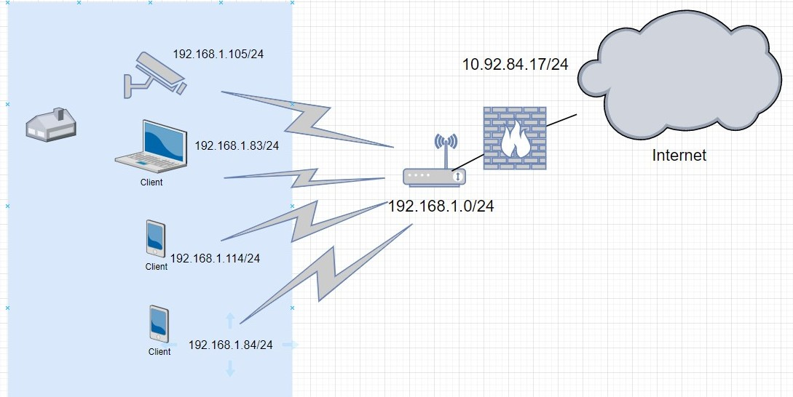

# Домашнее задание к занятию "3.8. Компьютерные сети, лекция 3"

(1) Подключитесь к публичному маршрутизатору в интернет. Найдите маршрут к вашему публичному IP

```
telnet route-views.routeviews.org
Username: rviews
show ip route x.x.x.x/32
show bgp x.x.x.x/32
```

*Решение:*

С маской /32 не стал работать

```
root@DESKTOP-VH87M18:/mnt/c/Windows/System32# telnet route-views.routeviews.org
Trying 128.223.51.103...
Connected to route-views.routeviews.org.
Escape character is '^]'.
C
**********************************************************************

                    RouteViews BGP Route Viewer
                    route-views.routeviews.org

 route views data is archived on http://archive.routeviews.org

 This hardware is part of a grant by the NSF.
 Please contact help@routeviews.org if you have questions, or
 if you wish to contribute your view.

 This router has views of full routing tables from several ASes.
 The list of peers is located at http://www.routeviews.org/peers
 in route-views.oregon-ix.net.txt

 NOTE: The hardware was upgraded in August 2014.  If you are seeing
 the error message, "no default Kerberos realm", you may want to
 in Mac OS X add "default unset autologin" to your ~/.telnetrc

 To login, use the username "rviews".

 **********************************************************************


User Access Verification

Username: rviews
route-views>show ip route 109.169.23.78/32
                                       ^
% Invalid input detected at '^' marker.

route-views>show ip route 109.169.23.78
Routing entry for 109.169.0.0/18
  Known via "bgp 6447", distance 20, metric 0
  Tag 6939, type external
  Last update from 64.71.137.241 3w1d ago
  Routing Descriptor Blocks:
  * 64.71.137.241, from 64.71.137.241, 3w1d ago
      Route metric is 0, traffic share count is 1
      AS Hops 2
      Route tag 6939
      MPLS label: none
route-views>show bgp 109.169.23.78
BGP routing table entry for 109.169.0.0/18, version 285552957
Paths: (23 available, best #22, table default)
  Not advertised to any peer
  Refresh Epoch 1
  8283 6461 20860
    94.142.247.3 from 94.142.247.3 (94.142.247.3)
      Origin IGP, metric 0, localpref 100, valid, external
      Community: 8283:1 8283:101
      unknown transitive attribute: flag 0xE0 type 0x20 length 0x18
        value 0000 205B 0000 0000 0000 0001 0000 205B
              0000 0005 0000 0001
      path 7FE094B06488 RPKI State not found
      rx pathid: 0, tx pathid: 0
  Refresh Epoch 1
  1351 6939 20860
    132.198.255.253 from 132.198.255.253 (132.198.255.253)
      Origin IGP, localpref 100, valid, external
      path 7FE02FECB0F0 RPKI State not found
      rx pathid: 0, tx pathid: 0
  Refresh Epoch 1
  852 6461 20860
    154.11.12.212 from 154.11.12.212 (96.1.209.43)
      Origin IGP, metric 0, localpref 100, valid, external
      path 7FE11D57E268 RPKI State not found
      rx pathid: 0, tx pathid: 0
  Refresh Epoch 1
  57866 6461 20860
    37.139.139.17 from 37.139.139.17 (37.139.139.17)
      Origin IGP, metric 0, localpref 100, valid, external
      Community: 57866:304 57866:501
      path 7FE1583F7120 RPKI State not found
      rx pathid: 0, tx pathid: 0
  Refresh Epoch 1
  20130 6939 20860
    140.192.8.16 from 140.192.8.16 (140.192.8.16)
      Origin IGP, localpref 100, valid, external
      path 7FE0BC9101E0 RPKI State not found
      rx pathid: 0, tx pathid: 0
  Refresh Epoch 1
  3333 1103 20860
    193.0.0.56 from 193.0.0.56 (193.0.0.56)
      Origin IGP, localpref 100, valid, external
      Community: 8714:65010 8714:65011 8714:65023
      unknown transitive attribute: flag 0xE0 type 0x20 length 0x24
        value 0000 220A 0000 03E8 0000 0002 0000 220A
              0000 03E9 0000 0001 0000 220A 0000 03E9
              0000 0002
      path 7FE1167D8828 RPKI State not found
      rx pathid: 0, tx pathid: 0
  Refresh Epoch 1
  3549 3356 6461 20860
    208.51.134.254 from 208.51.134.254 (67.16.168.191)
      Origin IGP, metric 0, localpref 100, valid, external
      Community: 3356:3 3356:22 3356:86 3356:575 3356:666 3356:903 3356:2011 3549:2581 3549:30840
      path 7FE1242195C8 RPKI State not found
      rx pathid: 0, tx pathid: 0
  Refresh Epoch 1
  701 6461 20860
    137.39.3.55 from 137.39.3.55 (137.39.3.55)
      Origin IGP, localpref 100, valid, external
      path 7FE085F718D8 RPKI State not found
      rx pathid: 0, tx pathid: 0
  Refresh Epoch 1
  53767 174 20860
    162.251.163.2 from 162.251.163.2 (162.251.162.3)
      Origin IGP, localpref 100, valid, external
      Community: 174:21101 174:22012 53767:5000
      path 7FE1795F4E68 RPKI State not found
      rx pathid: 0, tx pathid: 0
  Refresh Epoch 1
  3356 6461 20860
    4.68.4.46 from 4.68.4.46 (4.69.184.201)
      Origin IGP, metric 0, localpref 100, valid, external
      Community: 3356:3 3356:22 3356:86 3356:575 3356:666 3356:903 3356:2012
      path 7FE0C89DCDE8 RPKI State not found
      rx pathid: 0, tx pathid: 0
  Refresh Epoch 1
  4901 6079 6461 20860
    162.250.137.254 from 162.250.137.254 (162.250.137.254)
      Origin IGP, localpref 100, valid, external
      Community: 65000:10100 65000:10300 65000:10400
      path 7FE0E9563D00 RPKI State not found
      rx pathid: 0, tx pathid: 0
  Refresh Epoch 1
  20912 3257 174 20860
    212.66.96.126 from 212.66.96.126 (212.66.96.126)
      Origin IGP, localpref 100, valid, external
      Community: 3257:8070 3257:30155 3257:50001 3257:53900 3257:53902 20912:65004
      path 7FE0FE147CB8 RPKI State not found
      rx pathid: 0, tx pathid: 0
  Refresh Epoch 1
  3303 20860
    217.192.89.50 from 217.192.89.50 (138.187.128.158)
      Origin IGP, localpref 100, valid, external
      Community: 3303:1004 3303:1006 3303:1030 3303:3050
      path 7FE0E0FA36F8 RPKI State not found
      rx pathid: 0, tx pathid: 0
  Refresh Epoch 1
  7018 6461 20860
    12.0.1.63 from 12.0.1.63 (12.0.1.63)
      Origin IGP, localpref 100, valid, external
      Community: 7018:5000 7018:37232
      path 7FE15AE038E8 RPKI State not found
      rx pathid: 0, tx pathid: 0
  Refresh Epoch 1
  7660 2516 6461 20860
    203.181.248.168 from 203.181.248.168 (203.181.248.168)
      Origin IGP, localpref 100, valid, external
      Community: 2516:1030 7660:9003
      path 7FE0E7A67398 RPKI State not found
      rx pathid: 0, tx pathid: 0
  Refresh Epoch 1
  3561 209 3356 174 20860
    206.24.210.80 from 206.24.210.80 (206.24.210.80)
      Origin IGP, localpref 100, valid, external
      path 7FE0A72633D0 RPKI State not found
      rx pathid: 0, tx pathid: 0
  Refresh Epoch 1
  101 11164 6461 20860
    209.124.176.223 from 209.124.176.223 (209.124.176.223)
      Origin IGP, localpref 100, valid, external
      Community: 101:20100 101:22100 11164:1110 11164:7890
      Extended Community: RT:101:22100
      path 7FE0AA27C8A8 RPKI State not found
      rx pathid: 0, tx pathid: 0
  Refresh Epoch 2
  2497 174 20860
    202.232.0.2 from 202.232.0.2 (58.138.96.254)
      Origin IGP, localpref 100, valid, external
      path 7FE0D97651A8 RPKI State not found
      rx pathid: 0, tx pathid: 0
  Refresh Epoch 1
  49788 12552 20860
    91.218.184.60 from 91.218.184.60 (91.218.184.60)
      Origin IGP, localpref 100, valid, external
      Community: 12552:12000 12552:12400 12552:12401 12552:22000
      Extended Community: 0x43:100:1
      path 7FE12803C490 RPKI State not found
      rx pathid: 0, tx pathid: 0
  Refresh Epoch 1
  1221 4637 20860
    203.62.252.83 from 203.62.252.83 (203.62.252.83)
 --More--
```

(2) Создайте dummy0 интерфейс в Ubuntu. Добавьте несколько статических маршрутов. Проверьте таблицу маршрутизации.

*Решение:*

```
root@vagrant:~# lsmod | grep dummy
dummy                  16384  0
root@vagrant:~#  ifconfig -a | grep dummy
root@vagrant:~# modprobe -v dummy numdummies=2
root@vagrant:~# lsmod | grep dummy
dummy                  16384  0
root@vagrant:~# ifconfig -a | grep dummy
root@vagrant:~# ip link add dummy0 type dummy
root@vagrant:~# ifconfig -a | grep dummy
dummy0: flags=130<BROADCAST,NOARP>  mtu 1500
root@vagrant:~# ip link add dummy1 type dummy
root@vagrant:~# ip link list
1: lo: <LOOPBACK,UP,LOWER_UP> mtu 65536 qdisc noqueue state UNKNOWN mode DEFAULT group default qlen 1000
    link/loopback 00:00:00:00:00:00 brd 00:00:00:00:00:00
2: eth0: <BROADCAST,MULTICAST,UP,LOWER_UP> mtu 1500 qdisc fq_codel state UP mode DEFAULT group default qlen 1000
    link/ether 08:00:27:b1:28:5d brd ff:ff:ff:ff:ff:ff
3: dummy0: <BROADCAST,NOARP> mtu 1500 qdisc noop state DOWN mode DEFAULT group default qlen 1000
    link/ether 4e:58:46:c7:a6:ed brd ff:ff:ff:ff:ff:ff
4: dummy1: <BROADCAST,NOARP> mtu 1500 qdisc noop state DOWN mode DEFAULT group default qlen 1000
    link/ether 6e:c0:7d:d8:14:ef brd ff:ff:ff:ff:ff:ff
root@vagrant:~# ip addr add 192.168.1.150/24 dev dummy0
root@vagrant:~# ip link list
1: lo: <LOOPBACK,UP,LOWER_UP> mtu 65536 qdisc noqueue state UNKNOWN mode DEFAULT group default qlen 1000
    link/loopback 00:00:00:00:00:00 brd 00:00:00:00:00:00
2: eth0: <BROADCAST,MULTICAST,UP,LOWER_UP> mtu 1500 qdisc fq_codel state UP mode DEFAULT group default qlen 1000
    link/ether 08:00:27:b1:28:5d brd ff:ff:ff:ff:ff:ff
3: dummy0: <BROADCAST,NOARP> mtu 1500 qdisc noop state DOWN mode DEFAULT group default qlen 1000
    link/ether 4e:58:46:c7:a6:ed brd ff:ff:ff:ff:ff:ff
4: dummy1: <BROADCAST,NOARP> mtu 1500 qdisc noop state DOWN mode DEFAULT group default qlen 1000
    link/ether 6e:c0:7d:d8:14:ef brd ff:ff:ff:ff:ff:ff
root@vagrant:~# ifconfig -a
dummy0: flags=130<BROADCAST,NOARP>  mtu 1500
        inet 192.168.1.150  netmask 255.255.255.0  broadcast 0.0.0.0
        ether 4e:58:46:c7:a6:ed  txqueuelen 1000  (Ethernet)
        RX packets 0  bytes 0 (0.0 B)
        RX errors 0  dropped 0  overruns 0  frame 0
        TX packets 0  bytes 0 (0.0 B)
        TX errors 0  dropped 0 overruns 0  carrier 0  collisions 0

dummy1: flags=130<BROADCAST,NOARP>  mtu 1500
        ether 6e:c0:7d:d8:14:ef  txqueuelen 1000  (Ethernet)
        RX packets 0  bytes 0 (0.0 B)
        RX errors 0  dropped 0  overruns 0  frame 0
        TX packets 0  bytes 0 (0.0 B)
        TX errors 0  dropped 0 overruns 0  carrier 0  collisions 0

eth0: flags=4163<UP,BROADCAST,RUNNING,MULTICAST>  mtu 1500
        inet 10.0.2.15  netmask 255.255.255.0  broadcast 10.0.2.255
        inet6 fe80::a00:27ff:feb1:285d  prefixlen 64  scopeid 0x20<link>
        ether 08:00:27:b1:28:5d  txqueuelen 1000  (Ethernet)
        RX packets 637  bytes 89170 (89.1 KB)
        RX errors 0  dropped 0  overruns 0  frame 0
        TX packets 459  bytes 70107 (70.1 KB)
        TX errors 0  dropped 0 overruns 0  carrier 0  collisions 0

lo: flags=73<UP,LOOPBACK,RUNNING>  mtu 65536
        inet 127.0.0.1  netmask 255.0.0.0
        inet6 ::1  prefixlen 128  scopeid 0x10<host>
        loop  txqueuelen 1000  (Local Loopback)
        RX packets 12  bytes 1068 (1.0 KB)
        RX errors 0  dropped 0  overruns 0  frame 0
        TX packets 12  bytes 1068 (1.0 KB)
        TX errors 0  dropped 0 overruns 0  carrier 0  collisions 0

root@vagrant:~# ip addr add 192.168.1.151/24 dev dummy1
root@vagrant:~# ifconfig -a
dummy0: flags=130<BROADCAST,NOARP>  mtu 1500
        inet 192.168.1.150  netmask 255.255.255.0  broadcast 0.0.0.0
        ether 4e:58:46:c7:a6:ed  txqueuelen 1000  (Ethernet)
        RX packets 0  bytes 0 (0.0 B)
        RX errors 0  dropped 0  overruns 0  frame 0
        TX packets 0  bytes 0 (0.0 B)
        TX errors 0  dropped 0 overruns 0  carrier 0  collisions 0

dummy1: flags=130<BROADCAST,NOARP>  mtu 1500
        inet 192.168.1.151  netmask 255.255.255.0  broadcast 0.0.0.0
        ether 6e:c0:7d:d8:14:ef  txqueuelen 1000  (Ethernet)
        RX packets 0  bytes 0 (0.0 B)
        RX errors 0  dropped 0  overruns 0  frame 0
        TX packets 0  bytes 0 (0.0 B)
        TX errors 0  dropped 0 overruns 0  carrier 0  collisions 0

eth0: flags=4163<UP,BROADCAST,RUNNING,MULTICAST>  mtu 1500
        inet 10.0.2.15  netmask 255.255.255.0  broadcast 10.0.2.255
        inet6 fe80::a00:27ff:feb1:285d  prefixlen 64  scopeid 0x20<link>
        ether 08:00:27:b1:28:5d  txqueuelen 1000  (Ethernet)
        RX packets 691  bytes 93160 (93.1 KB)
        RX errors 0  dropped 0  overruns 0  frame 0
        TX packets 488  bytes 73117 (73.1 KB)
        TX errors 0  dropped 0 overruns 0  carrier 0  collisions 0

lo: flags=73<UP,LOOPBACK,RUNNING>  mtu 65536
        inet 127.0.0.1  netmask 255.0.0.0
        inet6 ::1  prefixlen 128  scopeid 0x10<host>
        loop  txqueuelen 1000  (Local Loopback)
        RX packets 12  bytes 1068 (1.0 KB)
        RX errors 0  dropped 0  overruns 0  frame 0
        TX packets 12  bytes 1068 (1.0 KB)
        TX errors 0  dropped 0 overruns 0  carrier 0  collisions 0
```


(3) Проверьте открытые TCP порты в Ubuntu, какие протоколы и приложения используют эти порты? Приведите несколько примеров.

*Решение:*

```
root@vagrant:~# netstat -ntlp | grep LISTEN
tcp        0      0 127.0.0.53:53           0.0.0.0:*               LISTEN      600/systemd-resolve
tcp        0      0 0.0.0.0:22              0.0.0.0:*               LISTEN      667/sshd: /usr/sbin
tcp6       0      0 :::22                   :::*                    LISTEN      667/sshd: /usr/sbin
```

systemd-resolved — служба systemd, выполняющая разрешение сетевых имён для локальных приложений посредством D-Bus, NSS-службы resolve или локальной слушающей DNS-заглушки на адресе 127.0.0.53.

sshd (SSH Daemon) это программа-демон для ssh(1). Вместе эти программы заменяют rlogin и rsh и предоставляют защищенную и зашифрованную связь между двумя не доверенными компьютерами через незащищенную сеть. Установка и использование программ упрощены настолько, насколько это возможно.
sshd это демон, который ожидает соединения от клиентов. Обычно он запускается при загрузке системы из /etc/rc. Он создает нового демона для каждого нового соединения. Ответвленный демон обрабатывает обмен ключами, шифрование, аутентификацию, выполнение команд и обмен данными

(4) Проверьте используемые UDP сокеты в Ubuntu, какие протоколы и приложения используют эти порты?

*Решение:*

```
root@vagrant:~# ss -ltupn
Netid       State        Recv-Q        Send-Q                Local Address:Port               Peer Address:Port       Process

udp         UNCONN       0             0                     127.0.0.53%lo:53                      0.0.0.0:*           users:(("systemd-resolve",pid=600,fd=12))

udp         UNCONN       0             0                    10.0.2.15%eth0:68                      0.0.0.0:*           users:(("systemd-network",pid=598,fd=19))

tcp         LISTEN       0             4096                  127.0.0.53%lo:53                      0.0.0.0:*           users:(("systemd-resolve",pid=600,fd=13))

tcp         LISTEN       0             128                         0.0.0.0:22                      0.0.0.0:*           users:(("sshd",pid=667,fd=3))

tcp         LISTEN       0             128                            [::]:22                         [::]:*           users:(("sshd",pid=667,fd=4))
```

systemd-networkd — системный демон для управления сетевыми настройками. Его задачей является обнаружение и настройка сетевых устройств по мере их появления, а также создание виртуальных сетевых устройств.

systemd-resolved — служба systemd, выполняющая разрешение сетевых имён для локальных приложений посредством D-Bus, NSS-службы resolve или локальной слушающей DNS-заглушки на адресе 127.0.0.53.

(5) Используя diagrams.net, создайте L3 диаграмму вашей домашней сети или любой другой сети, с которой вы работали.

*Решение:*


